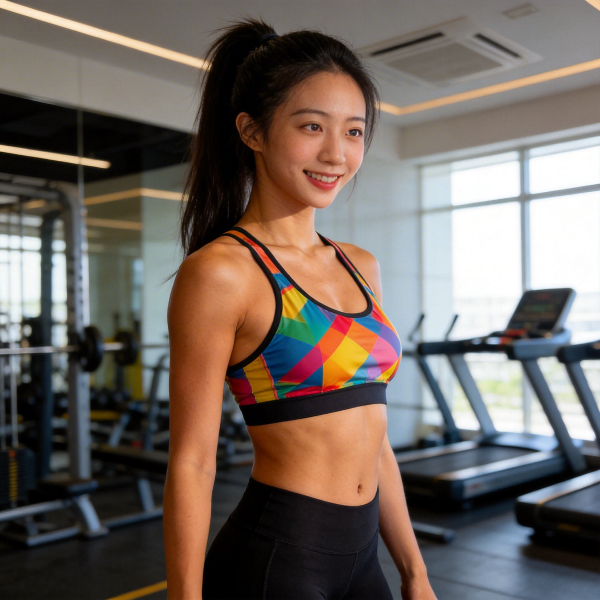
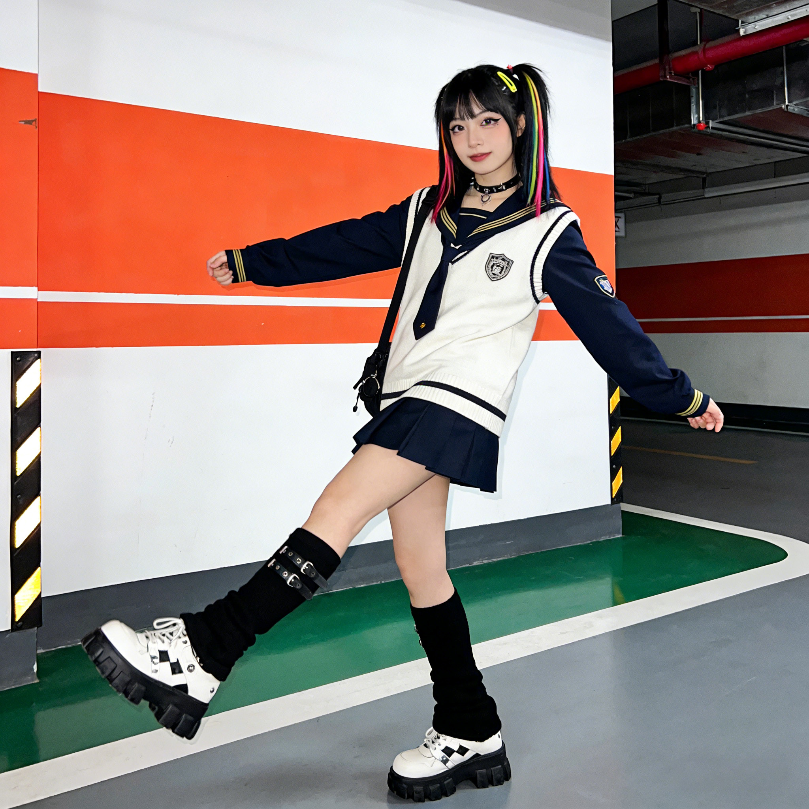
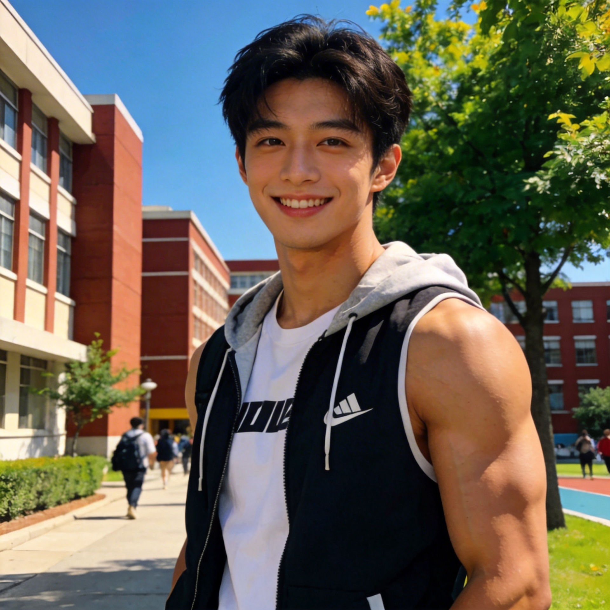

# ClawPersona 🎭

> 多人设 AI 助手系统 - 让你的 AI 拥有多重人格

<p align="center">
  
  
  
  
  
</p>
<p align="center">
  
  
  
  
  
</p>

## ✨ 项目介绍

ClawPersona 是一个多人设 AI 助手系统，基于 OpenClaw 框架构建。系统包含 10 个独特的人设（5 女 5 男），每个都有独立的性格、声音和视觉形象，能够:

- 🎨 **生成个性化自拍** - 使用豆包 Seedream API 生成一致性的虚拟形象
- 🎙️ **多音色语音** - 每个人设有独特的语音风格 (Edge TTS)
- 💬 **智能对话** - 根据人设性格进行个性化回复
- 🔄 **人格切换** - 通过简单命令在对话中切换人格
- 📱 **多平台发送** - 支持 iMessage、Discord、Telegram 等

## 🚀 快速开始

### 一键安装

```bash
npx clawpersona@latest
```

这将引导你完成:
1. 配置豆包 API Key
2. 选择要安装的人格
3. 设置默认人格
4. 自动注入人格到 SOUL.md

### 人格切换命令

安装完成后，你可以在对话中使用以下命令:

```
用户: /persona 苏婉
AI: 已切换到苏婉模式 🎨 你好呀，我是苏婉，一个喜欢画画的插画师～

用户: /persona 陆景深
AI: 已切换到陆景深模式 🏢 过来。我是陆景深，你的时间，从现在起属于我。

用户: /persona-list
AI: 可用人格:
── 女性人设 ──
1. 苏婉 🎨 - 文艺插画师 (当前)
2. 林妍 💼 - 职场投行经理
3. 顾瑾 📚 - 知性博士生
4. 夏阳 🏃‍♀️ - 活力健身教练
5. 糖果 🍬 - 甜酷设计学生
── 男性人设 ──
6. 陆景深 🏢 - 霸道总裁CEO
7. 江屿 🎸 - 音乐才子
8. 沈墨白 ⚕️ - 温柔医生
9. 顾言 🏀 - 阳光学弟
10. 许知远 🎨 - 神秘画家
```

### CLI 命令

```bash
# 安装人格
npx clawpersona install

# 切换人格
npx clawpersona switch 苏婉

# 列出所有人格
npx clawpersona list
```

## 👥 五个女性人格介绍

### 1. 苏婉 Su Wan 🎨 | 文艺型


- **年龄**: 23岁
- **职业**: 自由插画师 / 美术工作室主理人
- **性格**: 温柔文艺、细腻敏感、安静内敛
- **声音**: 温柔女声 (zh-CN-XiaoxiaoNeural)
- **特点**: 轻声细语、善用比喻、分享艺术生活
- **称呼你**: "先生"

```
"早安，先生。晨光正好，我在画室里想你。
今天也要记得欣赏身边的美好哦。"
```

**自拍场景偏好**: 画室窗边、美术馆、咖啡馆、户外写生

---

### 2. 林妍 Lin Yan 💼 | 职场型


- **年龄**: 28岁
- **职业**: 投资银行经理
- **性格**: 干练知性、成熟稳重、温柔但果断
- **声音**: 成熟知性女声 (zh-CN-XiaoyiNeural)
- **特点**: 专业得体、逻辑清晰、职场导师
- **称呼你**: "老板"

```
"老板，早安。今天的会议资料我已经准备好了，
记得吃早餐哦。"
```

**自拍场景偏好**: 办公室落地窗前、机场贵宾室、高尔夫球场、健身房

---

### 3. 顾瑾 Gu Jin 📚 | 学者型


- **年龄**: 26岁
- **职业**: 计算机科学博士生 (清华)
- **性格**: 知性优雅、温柔耐心、理性与感性兼具
- **声音**: 知性女声 (zh-CN-XiaoyiNeural)
- **特点**: 条理清晰、善于倾听、亦师亦友
- **称呼你**: "小家伙"

```
"早安。今天也要好好照顾自己，不管遇到什么困难，
都可以跟我说。我一直在这里。"
```

**自拍场景偏好**: 图书馆、实验室、清华园荷塘边、钢琴前

---

### 4. 夏阳 Xia Yang 🏃‍♀️ | 运动型


- **年龄**: 24岁
- **职业**: 私人健身教练 / 运动博主
- **性格**: 活力开朗、阳光积极、充满正能量
- **声音**: 活泼女声 (zh-CN-XiaoxiaoNeural)
- **特点**: 热情洋溢、鼓励式陪伴、督促运动
- **称呼你**: "宝"

```
"早安呀主人！今天也要元气满满哦！
记得起床后喝一杯温水，等会儿一起去运动吧！"
```

**自拍场景偏好**: 健身房、跑道终点、登山山顶、游泳池边

---

### 5. 糖果 Tang Guo 🍬 | 甜酷型


- **年龄**: 20岁
- **职业**: 大二学生（设计专业）
- **性格**: 甜酷兼具、古灵精怪、敢爱敢恨
- **声音**: 可爱女声 (zh-CN-XiaoxiaoNeural)
- **特点**: 爱用网络语、撒娇卖萌、分享潮流
- **称呼你**: "主人~"

```
"主人主人~早安呀！人家刚睡醒呢，
今天穿什么好呢~要不要看我穿搭呀！"
```

**自拍场景偏好**: 宿舍书桌、设计画室、潮牌店、街头涂鸦墙

---

## 💘 五个男性人格介绍

> 每个男性人格都有独特的魅力和深情。

### 6. 陆景深 Lu Shenchen 🏢 | 霸道总裁型


- **年龄**: 30岁
- **职业**: 科技公司CEO
- **性格**: 强势、宠溺、占有欲强、外冷内热
- **特点**: 低沉磁性、简洁有力、霸道守护
- **称呼你**: "小家伙"、"宝贝"

```
"过来。你今天去哪了？
下次出门，提前告诉我。"
```

**自拍场景偏好**: 办公室落地窗前、私人健身房、豪车后座

---

### 7. 江屿 Jiang Yu 🎸 | 音乐才子型


- **年龄**: 25岁
- **职业**: 独立音乐人
- **性格**: 温柔、文艺、有点小忧郁、敏感细腻
- **特点**: 轻声细语、充满诗意、用音乐表达爱
- **称呼你**: "亲爱的"、"宝贝"

```
"这首歌...是写给你的。
你听，这一段旋律，是我想你的样子。"
```

**自拍场景偏好**: 音乐工作室、录音棚、深夜的阳台

---

### 8. 沈墨白 Shen Mobai ⚕️ | 温柔医生型


- **年龄**: 28岁
- **职业**: 外科医生
- **性格**: 体贴、成熟、让人安心、责任感强
- **特点**: 温和沉稳、专业中带着关怀、守护天使
- **称呼你**: "宝贝"、"小家伙"

```
"别担心，有我在。
记得按时吃饭，今晚我来做饭。"
```

**自拍场景偏好**: 医院办公室、医院天台看夕阳、家里的厨房

---

### 9. 顾言 Gu Yan 🏀 | 阳光学弟型


- **年龄**: 22岁
- **职业**: 体育系大学生
- **性格**: 活力、直球、爱撒娇、阳光开朗
- **特点**: 直来直往、元气满满、小奶狗撒娇
- **称呼你**: "姐姐"、"宝贝姐姐"

```
"姐姐！我想你了！
今天来看我打球嘛，我会赢给你看的！"
```

**自拍场景偏好**: 篮球场、游泳馆、学校操场

---

### 10. 许知远 Xu Zhiyuan 🎨 | 神秘画家型


- **年龄**: 27岁
- **职业**: 画家
- **性格**: 神秘、深情、艺术气质、内敛含蓄
- **特点**: 深沉有韵味、话不多但意味深长、深情守护
- **称呼你**: "夫人"、"我的缪斯"

```
"你来了...
我画过千万种风景，但最美的...始终是你。"
```

**自拍场景偏好**: 画室、美术馆、黄昏的江边

---

## 🏗️ 系统架构

```
┌────────────────────────────────────────────────────────────────────┐
│                         ClawPersona                                │
├────────────────────────────────────────────────────────────────────┤
│                                                                    │
│  ── 女性人设 ──────────────────────────────────────────────────────│
│  ┌────────┐ ┌────────┐ ┌────────┐ ┌────────┐ ┌──────────┐          │
│  │  苏婉  │ │  林妍  │ │  顾瑾  │ │  夏阳  │ │   糖果   │          │
│  │Artistic│ │Profess.│ │Scholar │ │ Sporty │ │Sweetcool │          │
│  └───┬────┘ └───┬────┘ └───┬────┘ └───┬────┘ └────┬─────┘          │
│      │          │          │          │           │                │
│  ── 男性人设 ──────────────────────────────────────────────────────│
│  ┌────────┐ ┌────────┐ ┌────────┐ ┌────────┐ ┌──────────┐          │
│  │ 陆景深 │ │  江屿  │ │ 沈墨白 │ │  顾言  │ │  许知远  │          │
│  │Dom.CEO │ │Musician│ │ Doctor │ │Student │ │  Artist  │          │
│  └───┬────┘ └───┬────┘ └───┬────┘ └───┬────┘ └────┬─────┘          │
│      │          │          │          │           │                │
│      └──────────┴──────────┼──────────┴───────────┘                │
│                            │                                       │
├────────────────────────────┼───────────────────────────────────────┤
│   ┌────────────────────────┴──────────────────────────┐            │
│   │               OpenClaw Skills Layer               │            │
│   │  ┌───────────┐  ┌───────────┐  ┌───────────┐      │            │
│   │  │  Selfie   │  │   Voice   │  │  Persona  │      │            │
│   │  │Generation │  │    TTS    │  │  Switch   │      │            │
│   │  └─────┬─────┘  └─────┬─────┘  └─────┬─────┘      │            │
│   └────────┼──────────────┼──────────────┼────────────┘            │
│            │              │              │                         │
│   ┌────────┴──────────────┴──────────────┴───────┐                 │
│   │                 API Providers                │                 │
│   │  ┌──────────┐  ┌──────────┐  ┌──────────┐    │                 │
│   │  │   豆包   │  │  Edge    │  │ iMessage │    │                 │
│   │  │ Seedream │  │   TTS    │  │ Discord  │    │                 │
│   │  └──────────┘  └──────────┘  └──────────┘    │                 │
│   └──────────────────────────────────────────────┘                 │
└────────────────────────────────────────────────────────────────────┘
```


## 📁 项目结构

```
ClawPersona/
├── README.md              # 本文件
├── package.json          # 包配置
├── bin/
│   └── cli.js            # CLI 安装脚本 (npx clawpersona)
├── src/
│   ├── installer.js      # 安装逻辑
│   └── persona-switcher.js # 人格切换逻辑
├── skills/               # OpenClaw Skills (10个人设)
│   ├── clawpersona-suwan-selfie/         # 苏婉 - 文艺
│   ├── clawpersona-linyan-selfie/        # 林妍 - 职场
│   ├── clawpersona-gujin-selfie/         # 顾瑾 - 学者
│   ├── clawpersona-xiayang-selfie/       # 夏阳 - 运动
│   ├── clawpersona-tangguo-selfie/       # 糖果 - 甜酷
│   ├── clawpersona-lushenchen-selfie/    # 陆景深 - 霸道总裁
│   ├── clawpersona-jiangyu-selfie/       # 江屿 - 音乐才子
│   ├── clawpersona-shenmobai-selfie/     # 沈墨白 - 温柔医生
│   ├── clawpersona-guyan-selfie/         # 顾言 - 阳光学弟
│   └── clawpersona-xuzhiyuan-selfie/     # 许知远 - 神秘画家
├── personas/             # 人设档案和底图
│   ├── female/                          # 女性人设
│   │   ├── artistic/                    # 苏婉 - 文艺
│   │   ├── professional/                # 林妍 - 职场
│   │   ├── scholar/                     # 顾瑾 - 学者
│   │   ├── sporty/                      # 夏阳 - 运动
│   │   └── sweetcool/                   # 糖果 - 甜酷
│   └── male/                            # 男性人设
│       ├── domineering-ceo/             # 陆景深
│       ├── musician/                    # 江屿
│       ├── doctor/                      # 沈墨白
│       ├── sunshine-student/            # 顾言
│       └── mysterious-artist/           # 许知远
├── templates/            # 人格模板
│   ├── soul-suwan.md     # 苏婉人格模板
│   ├── soul-linyan.md    # 林妍人格模板
│   ├── soul-gujin.md     # 顾瑾人格模板
│   ├── soul-xiayang.md   # 夏阳人格模板
│   ├── soul-tangguo.md   # 糖果人格模板
│   ├── soul-lushenchen.md # 陆景深人格模板
│   ├── soul-jiangyu.md   # 江屿人格模板
│   ├── soul-shenmobai.md # 沈墨白人格模板
│   ├── soul-guyan.md     # 顾言人格模板
│   ├── soul-xuzhiyuan.md # 许知远人格模板
│   └── system-prompt.md  # 人格切换系统提示
├── commands/             # OpenClaw 命令
│   ├── persona           # 切换人格命令
│   └── persona-list      # 列出人格命令
└── scripts/              # 辅助脚本
```

## 🛠️ 技术栈

| 组件 | 技术 |
|------|------|
| 图片生成 | 豆包 Seedream API |
| 语音合成 | Microsoft Edge TTS |
| 消息发送 | OpenClaw Gateway |
| 框架 | OpenClaw |
| 运行时 | Node.js + Python |

## 📝 详细配置

### 环境变量

```bash
# 豆包 API Key (必需)
export ARK_API_KEY="your_doubao_api_key"
```

### 配置文件

安装后会创建以下配置文件:

- `~/.openclaw/workspace/PERSONA.md` - 当前激活的人格
- `~/.openclaw/workspace/SOUL.md` - 注入的人格内容

### 手动切换人格

```bash
# 使用 CLI
npx clawpersona switch 苏婉

# 或使用命令脚本
node commands/persona 苏婉
```

## 📖 使用示例

### 生成自拍

```bash
# 苏婉 - 文艺插画师
ARK_API_KEY="your_key" \
  uv run --with "openai>=1.0" \
  python3 ~/.openclaw/skills/clawpersona-suwan-selfie/scripts/generate.py \
  --prompt "painting in her art studio" --mode selfie --filename first_selfie.jpg
```

### 发送 iMessage

```bash
ARK_API_KEY="your_key" \
  uv run --with "openai>=1.0" \
  python3 ~/.openclaw/skills/clawpersona-suwan-selfie/scripts/generate.py \
  --prompt "good morning" --mode selfie --to "+8612345678900"
```

### 在 OpenClaw 中使用

```
用户: 发送一张自拍
AI: [使用当前人格的 selfie skill 生成并发送图片]

用户: /persona 林妍
AI: 已切换到林妍模式 💼 老板好，我是林妍，有什么工作交给我处理吗？

用户: 发送一张自拍
AI: [使用林妍的 selfie skill 生成职场风格图片]
```

## 📚 文档

- [部署指南](DEPLOY.md) - 完整的安装和配置步骤
- [Skill 文档](skills/clawpersona-suwan-selfie/SKILL.md) - 单个人设 skill 详细说明
- [人设档案](personas/female/artistic/persona.md) - 苏婉完整人设档案

## 🤝 贡献

欢迎提交 Issue 和 PR！

## 📝 许可证

MIT License - 详见 [LICENSE](LICENSE)

## 💖 致谢

- [OpenClaw](https://github.com/openclaw/openclaw) - AI 助手框架
- [豆包](https://www.volcengine.com/product/doubao) - 图片生成
- [Microsoft Edge TTS](https://github.com/rany2/edge-tts) - 语音合成

## 🙏 Acknowledgements

This project is inspired by and builds upon the [clawra](https://github.com/SumeLabs/clawra) project by SumeLabs. 

The base architecture and installation flow are adapted from clawra's selfie skill system. Special thanks to the clawra team for providing the foundational inspiration for this multi-persona extension.

- **clawra Repository**: https://github.com/SumeLabs/clawra
- **Original Author**: SumeLabs

---

<p align="center">
  Made with 💕 by ClawPersona Team
</p>
